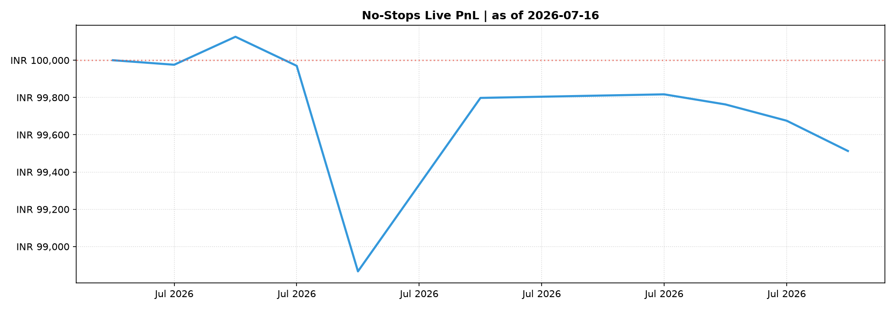

# Live Baseline No-Stops Systematic Portfolio Report

> **Date**: 2026-07-16  |  **Days Live**: 12  |  **Portfolio Mode**: Always Fully Invested

## Summary Stats
| Metric | Value |
| :--- | :---: |
| Starting Capital | **INR 100,000.00** |
| Current Value | **INR 99,512.93** |
| Total Return | **-0.49%** |

## Current Active Holdings
| Ticker | Shares | Entry Price | Current Price | Unrealised PnL |
| :--- | :---: | :---: | :---: | :---: |
| RELIANCE.NS | 1.0000 | INR 1300.45 | INR 1296.60 | **-0.30%** |
| HDFCBANK.NS | 3.0000 | INR 801.05 | INR 808.30 | **+0.91%** |
| HINDUNILVR.NS | 1.0000 | INR 2201.20 | INR 2098.40 | **-4.67%** |
| SUNPHARMA.NS | 1.0000 | INR 1904.80 | INR 1950.10 | **+2.38%** |
| TATASTEEL.NS | 14.0000 | INR 189.61 | INR 185.49 | **-2.17%** |
| BHARTIARTL.NS | 1.0000 | INR 1910.40 | INR 1921.80 | **+0.60%** |
| NTPC.NS | 7.0000 | INR 356.45 | INR 342.45 | **-3.93%** |
| DLF.NS | 4.0000 | INR 672.86 | INR 648.10 | **-3.68%** |
| BEL.NS | 6.0000 | INR 418.05 | INR 407.10 | **-2.62%** |
| PIDILITIND.NS | 1.0000 | INR 1598.00 | INR 1559.60 | **-2.40%** |
| COALINDIA.NS | 6.0000 | INR 436.25 | INR 427.35 | **-2.04%** |
| SBIN.NS | 2.0000 | INR 1040.00 | INR 1031.20 | **-0.85%** |
| BPCL.NS | 8.0000 | INR 308.15 | INR 312.00 | **+1.25%** |
| IREDA.NS | 22.0000 | INR 127.96 | INR 120.83 | **-5.57%** |
| LALPATHLAB.NS | 1.0000 | INR 1645.70 | INR 1732.70 | **+5.29%** |
| ICICIBANK.NS | 1.0000 | INR 1411.40 | INR 1418.20 | **+0.48%** |
| JSWSTEEL.NS | 2.0000 | INR 1230.20 | INR 1221.00 | **-0.75%** |
| CIPLA.NS | 1.0000 | INR 1458.20 | INR 1429.50 | **-1.97%** |
| AUBANK.NS | 2.0000 | INR 1058.40 | INR 1035.10 | **-2.20%** |
| TATACOMM.NS | 1.0000 | INR 1906.70 | INR 1839.90 | **-3.50%** |
| TRENT.NS | 1.0000 | INR 2927.80 | INR 2860.20 | **-2.31%** |
| VOLTAS.NS | 1.0000 | INR 1358.90 | INR 1373.90 | **+1.10%** |
| TCS.NS | 1.0000 | INR 2189.20 | INR 2201.00 | **+0.54%** |
| CONCOR.NS | 5.0000 | INR 492.90 | INR 490.30 | **-0.53%** |

**Cash on hand**: INR 48,632.66

## Live PnL Chart

## Recent Trade Log (Last 15)
| Date | Ticker | Action | Shares | Price | Value | Reason |
| :--- | :--- | :--- | :---: | :---: | :---: | :--- |
| 2026-07-16 | RELIANCE.NS | **SELL** | 1.0000 | INR 1296.60 | INR 1296.60 | Rebalance to target weight=0.025 |
| 2026-07-15 | CONCOR.NS | **BUY** | 5.0000 | INR 492.90 | INR 2464.50 | Rebalance to target weight=0.026 |
| 2026-07-15 | TCS.NS | **BUY** | 1.0000 | INR 2189.20 | INR 2189.20 | Rebalance to target weight=0.026 |
| 2026-07-14 | VOLTAS.NS | **BUY** | 1.0000 | INR 1358.90 | INR 1358.90 | Rebalance to target weight=0.026 |
| 2026-07-14 | IREDA.NS | **BUY** | 1.0000 | INR 122.08 | INR 122.08 | Rebalance to target weight=0.028 |
| 2026-07-14 | CONCOR.NS | **SELL** | 5.0000 | INR 493.15 | INR 2465.75 | Rebalance to target weight=0.000 |
| 2026-07-13 | IREDA.NS | **BUY** | 1.0000 | INR 124.81 | INR 124.81 | Rebalance to target weight=0.027 |
| 2026-07-13 | DLF.NS | **BUY** | 1.0000 | INR 682.35 | INR 682.35 | Rebalance to target weight=0.028 |
| 2026-07-13 | TATASTEEL.NS | **BUY** | 1.0000 | INR 187.11 | INR 187.11 | Rebalance to target weight=0.028 |
| 2026-07-13 | RELIANCE.NS | **BUY** | 1.0000 | INR 1296.90 | INR 1296.90 | Rebalance to target weight=0.027 |
| 2026-07-13 | VOLTAS.NS | **SELL** | 2.0000 | INR 1349.50 | INR 2699.00 | Rebalance to target weight=0.000 |
| 2026-07-13 | TCS.NS | **SELL** | 1.0000 | INR 2181.50 | INR 2181.50 | Rebalance to target weight=0.000 |
| 2026-07-10 | COALINDIA.NS | **BUY** | 1.0000 | INR 429.30 | INR 429.30 | Rebalance to target weight=0.026 |
| 2026-07-10 | IREDA.NS | **SELL** | 1.0000 | INR 126.40 | INR 126.40 | Rebalance to target weight=0.026 |
| 2026-07-10 | DLF.NS | **SELL** | 1.0000 | INR 685.75 | INR 685.75 | Rebalance to target weight=0.026 |