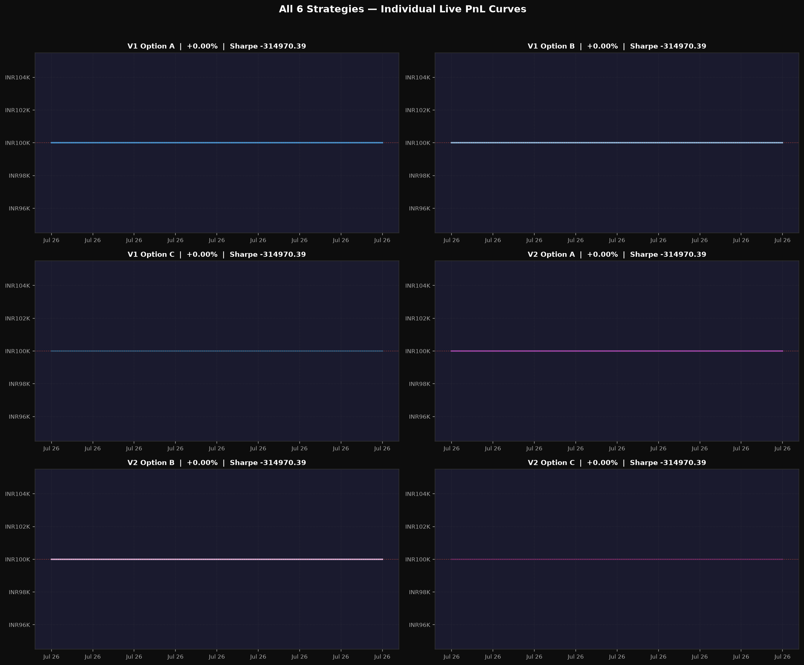
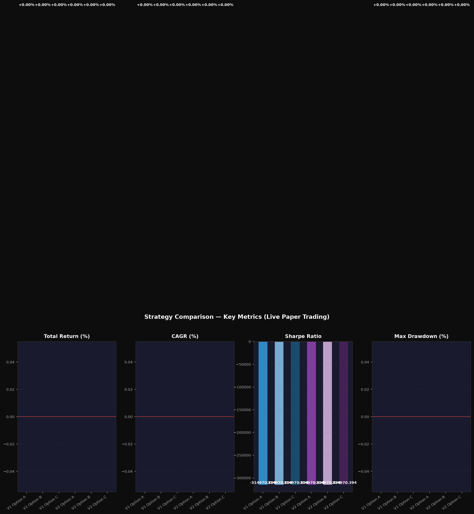

# Master Report — All 6 Strategies Live Comparison

> **Date**: 2026-07-03  |  **Starting Capital**: INR100,000 each

## Performance Leaderboard

| Rank | Strategy | Portfolio Value | Total Return | CAGR | Sharpe | Max DD | Win Rate |
| :---: | :--- | :---: | :---: | :---: | :---: | :---: | :---: |
| 🥇 | **V1 Option A** | INR100,000.00 | **+0.00%** | +0.00% | -314970.394 | 0.00% | 100.0% |
| 🥈 | **V1 Option B** | INR100,000.00 | **+0.00%** | +0.00% | -314970.394 | 0.00% | 100.0% |
| 🥉 | **V1 Option C** | INR100,000.00 | **+0.00%** | +0.00% | -314970.394 | 0.00% | 100.0% |
| 4️⃣ | **V2 Option A** | INR100,000.00 | **+0.00%** | +0.00% | -314970.394 | 0.00% | 100.0% |
| 5️⃣ | **V2 Option B** | INR100,000.00 | **+0.00%** | +0.00% | -314970.394 | 0.00% | 100.0% |
| 6️⃣ | **V2 Option C** | INR100,000.00 | **+0.00%** | +0.00% | -314970.394 | 0.00% | 100.0% |

> ⭐ Yellow border on bar chart = best performer in each metric.

## Individual PnL Curves (All 6)

## Metric Comparison Bar Chart

## Quick Links — Individual Reports

- **[V1 Option A](report_v1_a.md)** — INR100,000.00 | +0.00% | Sharpe -314970.394
- **[V1 Option B](report_v1_b.md)** — INR100,000.00 | +0.00% | Sharpe -314970.394
- **[V1 Option C](report_v1_c.md)** — INR100,000.00 | +0.00% | Sharpe -314970.394
- **[V2 Option A](report_v2_a.md)** — INR100,000.00 | +0.00% | Sharpe -314970.394
- **[V2 Option B](report_v2_b.md)** — INR100,000.00 | +0.00% | Sharpe -314970.394
- **[V2 Option C](report_v2_c.md)** — INR100,000.00 | +0.00% | Sharpe -314970.394

## Strategy Descriptions

| Strategy | Regime Engine | Entry Logic | Capital Mode |
| :--- | :--- | :--- | :--- |
| V1 Option A | EMA/HMA Crossover | HMA>EMA (Bull), BB lower band (Choppy) | 100% deployed |
| V1 Option B | EMA/HMA Crossover | Same as A | Dynamic (scales with breadth) |
| V1 Option C | EMA/HMA Crossover | Same as A | 70% A + 30% B blend |
| V2 Option A | Supertrend + HMA-BB | Supertrend green (Bull), HMA Band (Choppy) | 100% deployed |
| V2 Option B | Supertrend + HMA-BB | Same as A | Dynamic (scales with breadth) |
| V2 Option C | Supertrend + HMA-BB | Same as A | 70% A + 30% B blend |